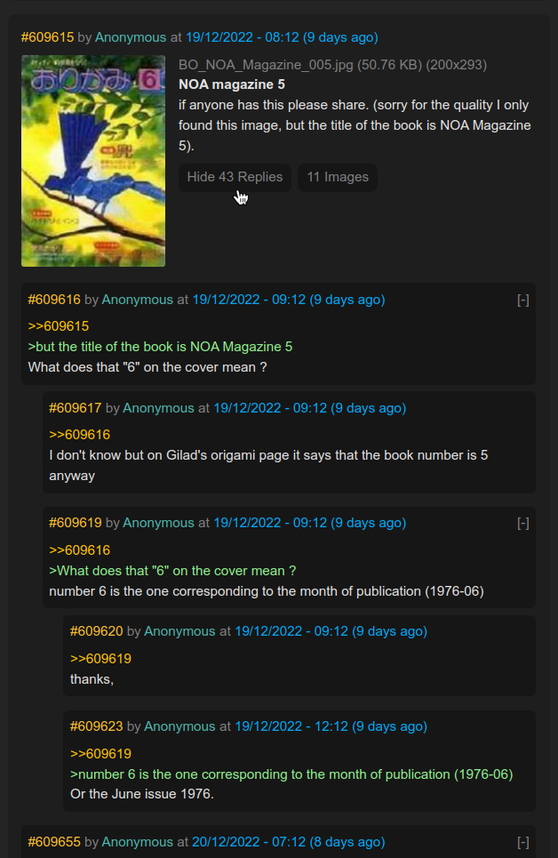

# 🌳 treechan 🍀
It's a read-only client for 4chan (https://4chan.org) designed to show threads and replies in a tree-based format.

Demo hosted at: http://chan.kek.church/



### Why?
I find the way 4chan organizes replies to threads very disorienting and unhelpful in determining the flow of conversations. In the 4chan web client, replies are shown in a flat list, in the order they were posted originally.

As a thread gets more replies, it is natural that multiple conversations in the form of reply chains begin to form. From here, every subsequent addition to the chain is just added to the big chronological list. 

This means that if you are scrolling through said list, you will be encountering posts from several reply chains that have little to nothing to do with each other constantly interweaved, forcing you to constantly switch context, and requiring you to meticulously verify which chain the reply actually replies to in order to keep up with the conversation.

All in all, it's annoying.

This is why this project exists - it is now very easy to follow the chain of replies because, well, it's actually shown properly! Replies to a post become its children, and get shown one level deeper. This is how Reddit structures its comments as well, and I believe it's quite an intuitive system that enhances user experience tenfold.

### App Design
The app is written in Svelte and runs almost entirely clientside, using nginx as a CORS proxy to 4chan's API servers. You can run one nginx container that both hosts the app and acts as the CORS proxy, making it very compact & easy to deploy. 

The app is around `38.43 KB` in size including all HTML, JS & CSS assets. With Gzip, it shrinks down to `14 KB` total. Building is powered by the Vite build system and types are enforced in the code with TypeScript.

Images of threads are loaded whenever they are scrolled into the view of the browser, aiming to eliminate spam-API calls to 4chan's API. The nginx CORS proxy also attaches `X-Forwarded-For` and `X-Real-IP` headers to every request in order to indicate the request's true origin.

### Installation

#### 1. Install host dependencies

In order to run treechan, you'll need Docker and Git. NodeJS is not required to be installed on the host as the build process is fully containerized for your convenience.

To verify you have Docker installed:
```
$ docker -v
Docker version 20.10.21, build baeda1f82a

$ git -v
git version 2.38.1
```

The Docker & git version don't have to match, just make sure you have something recent.

#### 2. Git-clone the repository
Now you **need to** clone the repository with Git. **This is important for the build script to run, do not download a zip file from GitHub!**

```
$ git clone --depth=1 https://github.com/xxcodianxx/treechan.git
```

#### 3. Run the start-up script

Now, you can simply use the included `run.sh` script and it will install and run treechan for you.

```
$ ./run.sh
```
Excluding network download times, the installation is extremely fast (about 2 seconds).

By default, the server runs on port `8080`, but this can be changed at the top of the `./run.sh` file.

Congrats, you now have treechan running. If you did this on your local machine, you can now visit http://localhost:8080 and enjoy.

If you did it on a server, just replace `localhost` with your server's IP. Remember to port forward port `8080` or your chosen port.
